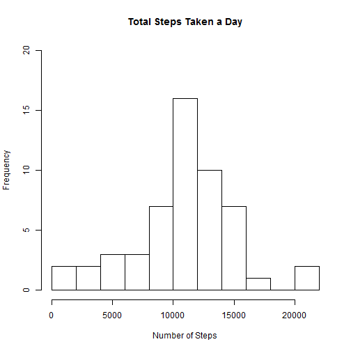
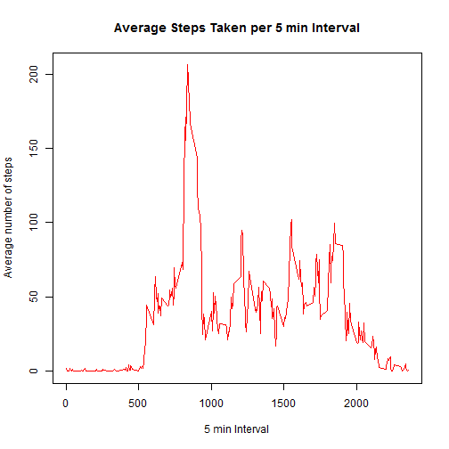
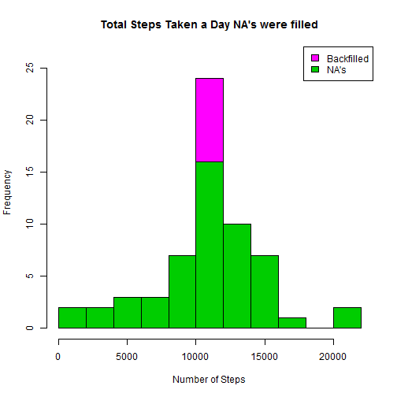

## Reproducible Research Project 1

###Questions 1,2,3

```r
library(ggplot2)

Activity <- read.csv("C:/Kelly/Coursera/RepoResearch/activity.csv")
stepsbyday<-aggregate(Activity$steps~Activity$date, FUN=sum)
#table(stepsbyday[,2])
hist(stepsbyday[,2],breaks=15,ylim=c(0,20),main="Total Steps Taken a Day",xlab="Number of Steps")
```



```r
#The mean and median are approximately the same, the distributed is somewhat symmetric and bell shaped
mean(stepsbyday[,2])
```

```
## [1] 10766.19
```

```r
median(stepsbyday[,2])
```

```
## [1] 10765
```

###Questions 4,5 Time Series Plot Average number of steps taken in a 5 min interval


```r
avgstepsbyinterval<-aggregate(Activity$steps~Activity$interval, FUN=mean)
plot(avgstepsbyinterval[,1],avgstepsbyinterval[,2],type="l",col="red",main="Average Steps Taken per 5 min Interval",xlab="5 min Interval",ylab="Average number of steps")
```



```r
#The interval with the highest average number of steps is:
maxnumberofsteps<-max(avgstepsbyinterval[,2])
avgstepsbyinterval[avgstepsbyinterval[,2]==maxnumberofsteps,1]
```

```
## [1] 835
```
###Questions 6,7 Missing Value Plugs
There are 2304 rows or 8 days with missing activity or NA's.  My strategy for backfilling the data is to 
enter the average value for that 5 min time interval.
Eight days of information were entered with a sum of 10,766.19 steps per day. 
This just made the frequency for the bin 10,000 to 12,000 steps change from 16 to 24 observations.
By backfilling the data with NA's the graph become more peaked and the mean and meadian basically did not change.  The mean now exactly equals the median.


```r
colnames(avgstepsbyinterval) <- c("interval","stepsfill")
test<-merge(Activity,avgstepsbyinterval, by ="interval")#sets up the new column of numbers to fill in for NA

my.na <- is.na(test$steps)
sum(my.na)
```

```
## [1] 2304
```

```r
test$steps[my.na] <- test$stepsfill[my.na]   #puts the new values into the NA

no.na <- is.na(test$steps)
sum(no.na)#check that there aren't any NA's
```

```
## [1] 0
```

```r
stepsbydaybackfill<-aggregate(test$steps~test$date, FUN=sum)


hist(stepsbydaybackfill[,2],breaks=15,col=6,ylim=c(0,26),main="Total Steps Taken a Day NA's were filled",xlab="Number of Steps")

hist(stepsbyday[,2],breaks=15,col=3,ylim=c(0,26),main="Total Steps Taken a Day",xlab="Number of Steps",add=T)
legend("topright", c("Backfilled", "NA's"), fill = c(6,3))
```



```r
mean(stepsbydaybackfill[,2])
```

```
## [1] 10766.19
```

```r
median(stepsbydaybackfill[,2])
```

```
## [1] 10766.19
```

```r
#some code I used for checking my work

#check<-subset(test,date=="10/1/2012") 
#checkb<-subset(test,date=="11/30/2012") 
#sum(test$steps)-sum(Activity$steps,na.rm=TRUE)
#sum(avgstepsbyinterval$stepsfill)*8
#sum(avgstepsbyinterval$stepsfill)
```
###Question 8 Average Number of steps taken per 5 min interval across weekday vs weekends
From the panel plot below we can see this person is very active during the morning on the weekday but has a higher more constant rate of activity on the weekends.


```r
test$date<-as.Date(test$date,format='%m/%d/%Y')
test$day<-weekdays(test$date)
test$weekstatus <- as.factor(ifelse(test$day == "Saturday" | test$day == "Sunday", "Weekend", "Weekday"))

averages <- aggregate(steps ~ interval + weekstatus, data=test, mean)
ggplot(averages, aes(interval, steps)) + geom_line() + facet_grid(weekstatus ~ .) +
    xlab("5-minute interval") + ylab("Number of steps")
```


